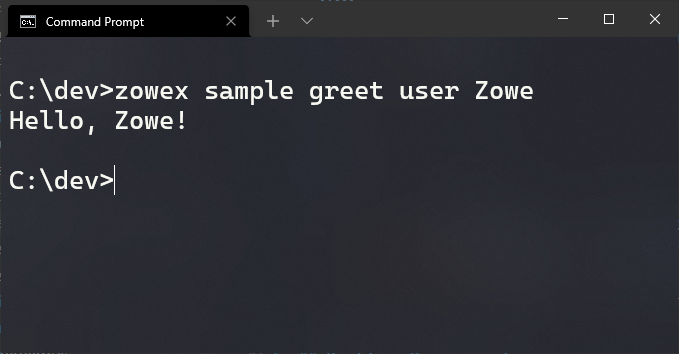
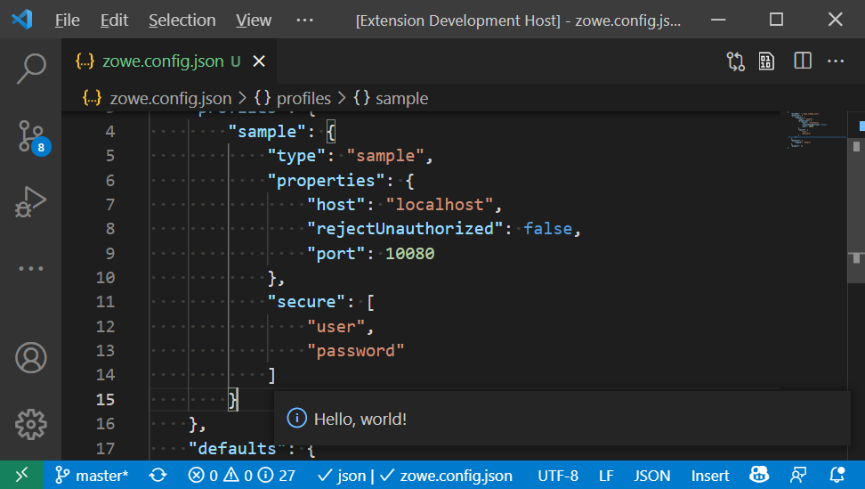

# Zowe Client Sample Apps

Sample Zowe Client applications which connect and use a sample REST API service and adhere to Zowe
conformance standards.

## Clients

* [Cli plugin](#cli-plugin) - Extends Zowe CLI with an installable plugin
* [Api on z/OS](#api-on-zos) - Creates REST API for a mainframe services
* [SDK in javascript](#sdk) - Client, reusable npm published code
* [Extension for VScode](#extension-for-vs-code) - Extends Zowe Explorer

## Building Prerequisites

`npm` version `7.20+` (`npm install -g npm`)

## Building

1. `git clone https://github.com/zowe/zowe-client-sample-apps`
2. `npm install`
3. `npm run build`

## CLI Plugin

A sample Zowe CLI plugin which calls the sample Zowe REST API.



See more information [here](./packages/cli/README.md).

## API on zOS

The Zowe Sample API Service helps you build a new, Zowe-conformant REST API .

See more information [here](https://github.com/zowe/sample-spring-boot-api-service/tree/master/zowe-rest-api-sample-spring#zowe-sample-api-service).

## SDK

TypeScript / JavaScript SDK to make your service callable via Node.js applications / scripts. The SDK supports both the Zowe CLI plugins as well as Zowe Explorer VS Code Extensions.

```typescript

import { Greeting } from "@zowe/sample-for-zowe-cli";
...

```

See more information [here](./packages/api/README.md).

## Extension for VS Code

Allows for graphical interactions to z/OS services.



See more information [here](./packages/vsce/README.md).

## Attributes

1. VS Code Extension & Zowe CLI plugin shared config
2. Testing skeleton
3. GitHub Actions (CI) skeleton
4. Husky commit hooks
5. Lint configurations
6. Prettier setup

## Deployment Models

* Zowe Explorer installed or not
* API ML active or not
* SSO enabled or not
* old profiles, project config, global config, no config
* secure and plain text passwords

## TODO

* comments
* tests
* localization
* webpack (sample vs code extensions)
* zowe explorer profile creation registration
* theia
* handle missing schema
* obtaining updates
* error handling in zowe explorer
* other extension types, e.g. extend tree menu
* remove `@zowe/cli` dependency for `vsce` package
* [conformance](https://github.com/zowe/vscode-extension-for-zowe/blob/62e4eb21302ca3fde479dfe0210aa51831b0ebc3/docs/README-Conformance.md)
